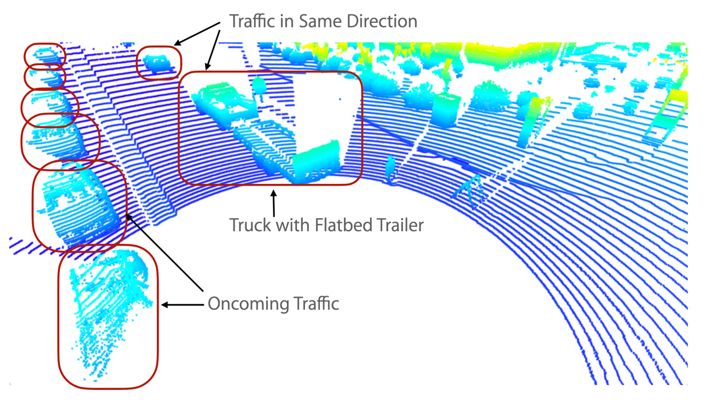
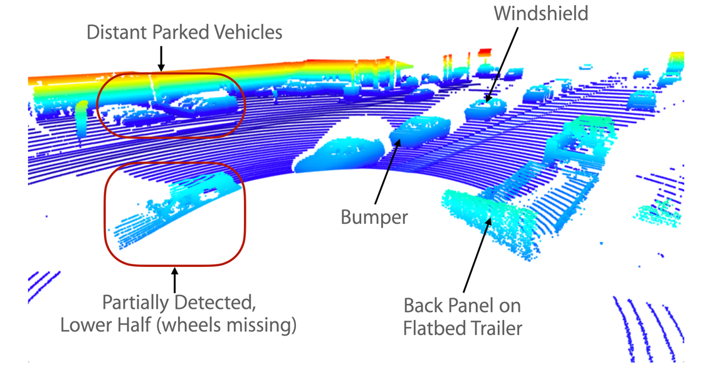
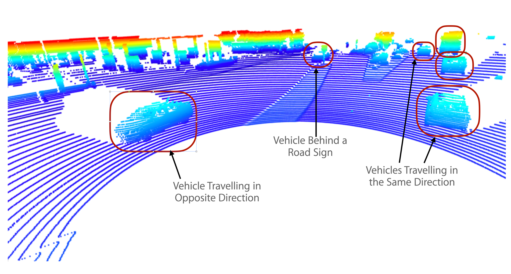
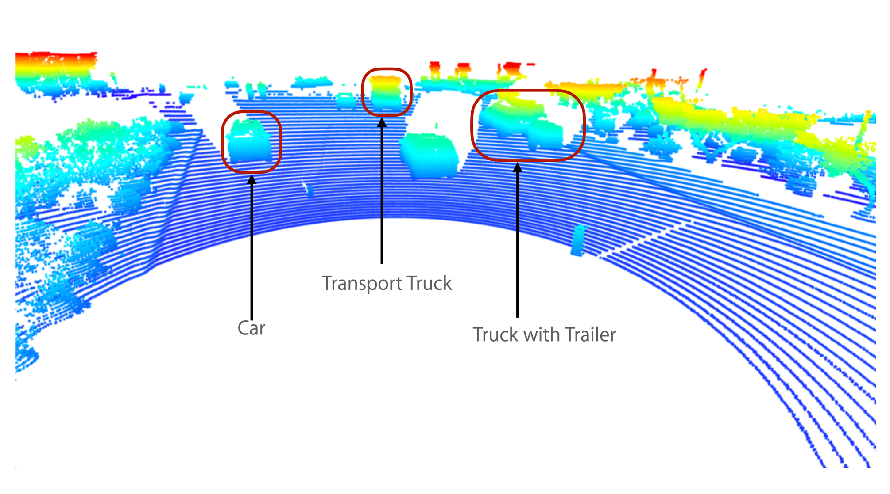

# Project WriteUp: Midterm 3D Object Detection
Udacity Self Driving Car Engineer Nanodegree: Monish Tandale

## Section 1: Point Cloud Visualization
This section provides 10 examples of vehicles with varying degress of visibility in the point cloud.

   
The above figure shows a truck with a flatbed trailer just outside the blindspot of the top lidar. Note that the vertical surfaces on the vehicles facing the lidar are seen most clearly and are the stable features detected by the lidar. Note that the gaps between the lidar lines is small on the vertical surfaces as the angle of incidence is closer to 90 degrees as opposed to horizontal surfaces where the angle of incidences are much smaller.

Also parts of some vehicles which lie in the shadows of other vehicles are not visible.

   
This figure shows the line of vehicles on the left traveling in the opposite direction. The first vehicle lies in the lidar's blind spot and hence the lower section of the vehicle including its tires is not visible in the point cloud. 

   
This figure shows the scenario where the flatbed is very close to the lidar and lies in the blind spot. Hence only part of the flatbed is visible.

   
In this figure parts of the truck as well as the flatbed are not visible.

   
In this figure the truck is almost alongside the lidar and hence the lower part of the truck is undetected.

   
This figure shows a construction truck parked at the street corner behind some barricades and another vehicle mkaing a right turn at the corner.  

## Section 2: Creating Birds Eye View from Lidar PCL

   
The above figure shows the Lidar PCL in BEV map coordinates.

   
The above figure shows the intensity channel of the BEV map. Note that vertical metallic surfaces e.g. licence plates, show high intensty and are clearly visible in the intensity map.  

   
The above figure shoes the height channel of the BEV map. Vertical vehicle surfaces facing the lidar are clearly visible in the map.

## Section 3: Model-based Object Detection in BEV Image

   
The above figure shows the bounding boxes identifed by the fpn-resnet model

## Section 4: Performance Evaluation for Object Detection
   
The above figure shows the object detection performance metrics. precision = 0.951, recall = 0.944
