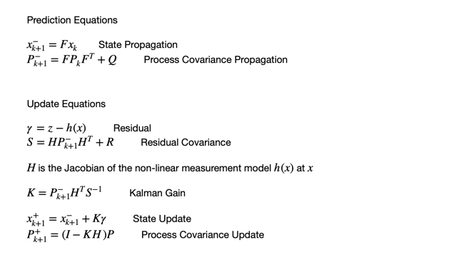
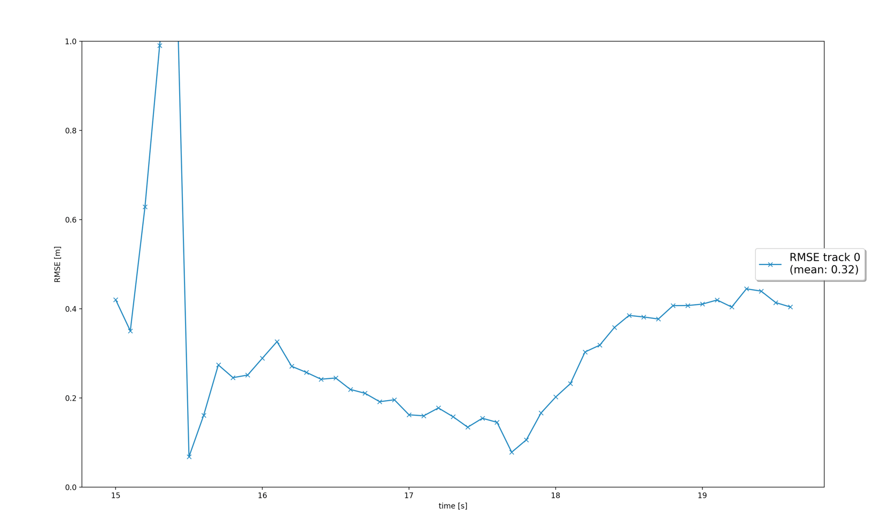
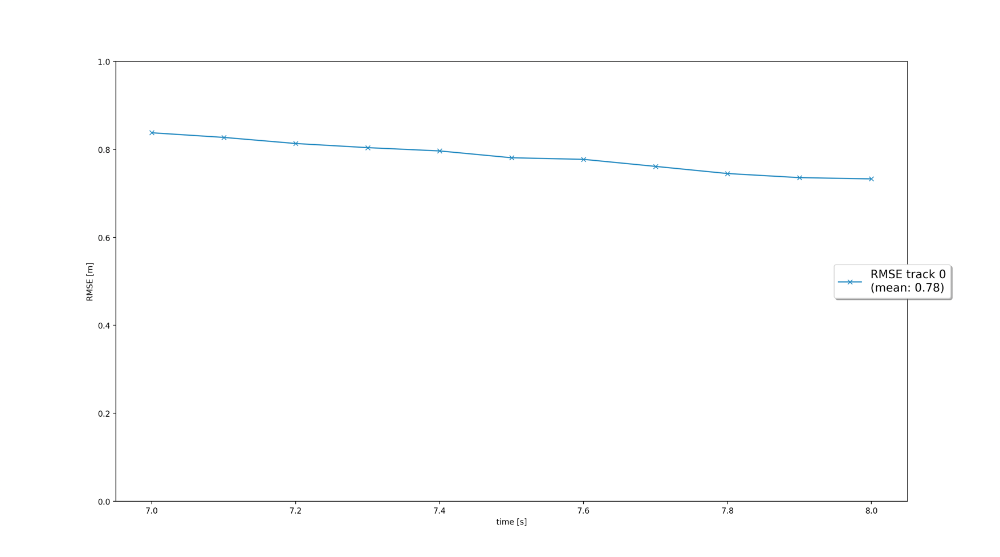
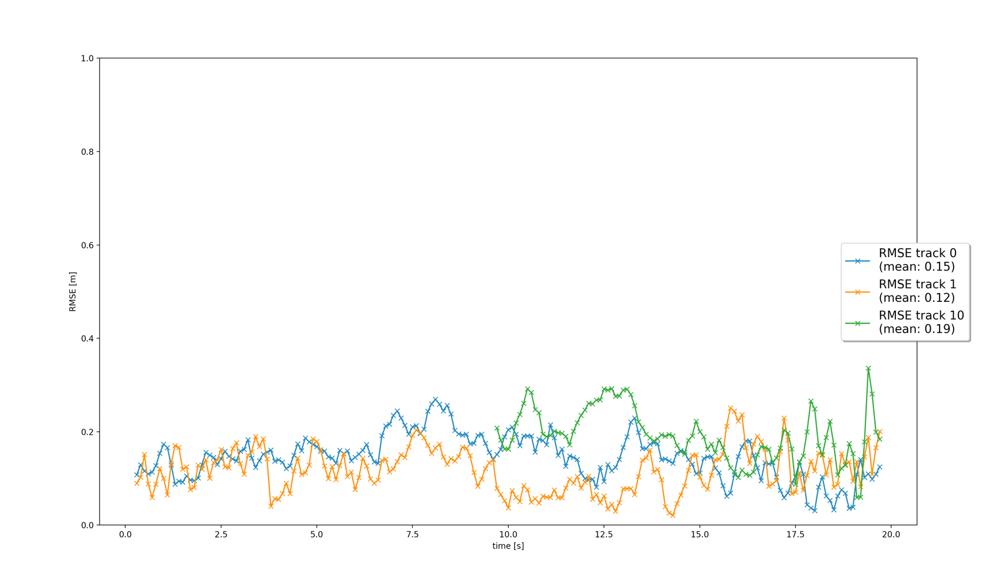
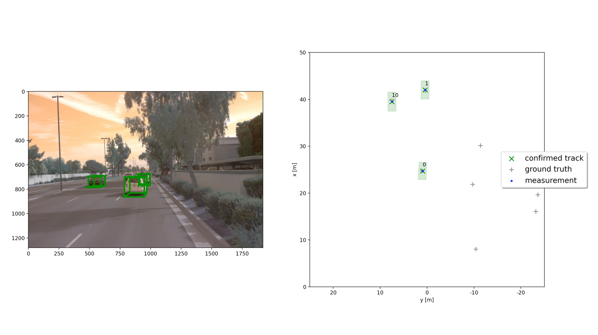
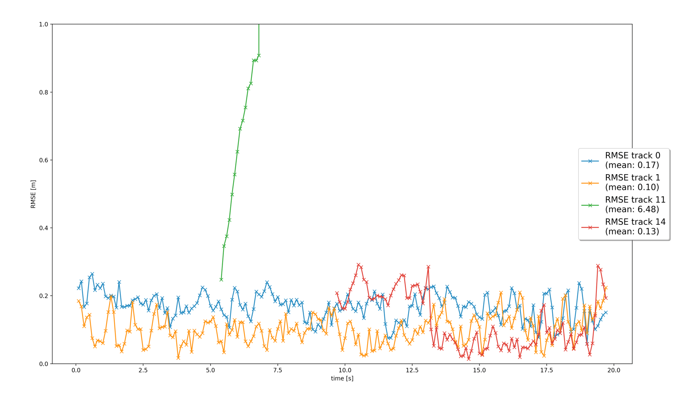
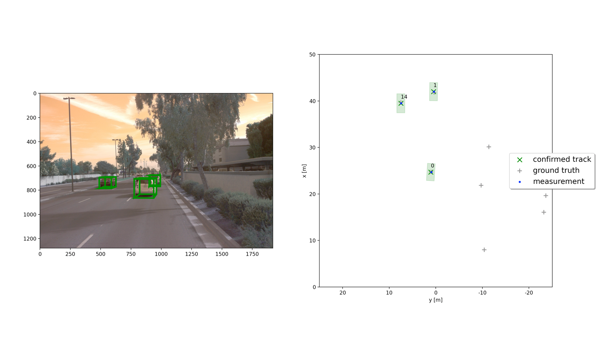

# Writeup: Track 3D-Objects Over Time

## 1. Recap
1. **Filter**: Under Step1 an EKF was implemented for a 3D motion model with constant velocity. The system matrix and process covariance are shown in the figure below.    
   
   
   The following equations were implemented for the prediction and update steps of the EKF.  
      
   
   
   
   The above figure shows the RSME (= 0.32) for the single target tracking scenario with lidar measurements only. 

2. **Track Management**: Under the track management step the following modules were coded.
   1. *Track Initialization for Unassigned Measurements*: Based on the lidar measurements and measurement covariance, the position vector in the filter state and its initial covariance were calculated by transforming the measurements from sensor to vehicle coordinates using the sens_to_veh transformation matrix. The velocities were initialized at zero and the covariance for velocity terms was set based on the config parameters provided (params.sigma_p44, params.sigma_p55, params.sigma_p66). The tracking score and tracking state was also initialized.
   2. *Track Management for Assigned Tracks*: For tracks that were associated with a measurement and subsequently updated, the track score was updated and track state was updated to tentative or confirmed based on the provided confirmed_threshold.
   3. *Track Management for Unassigned Tracks*: For tracks that were not associated with a measurement, the track score was decreased. Confirmed tracks were deleted if the score was below params.delete_threshold. For initialized or tentative tracks the delete threshold of 0.05 was used. Tracks were also deleted if the variances in the x and y position were greater than params.max_P.
   
   The RSME for the single vehicle tracking scenario in Step2 is 0.78 as shown in the figure above.
      

3. **Association**: The following activities were performed under Step3:
   1. A function was written to calculate the Mahalanobis distance for a track and measurement pair.
   2. A gating function was implemented to determine if the track and measurement were close enough to be considered for association. 
   3. An association matrix was created to store the Mahalanobis distance for all track and measurement pairs and the Simple Nearest Neighbor (SNN) algorithm was used to perform the track to measurement association.
   
   Tracking results for the Step3 senario are shown in the figures below. A total of 3 confirmed tracks are identified. The RMSE for all tracks is low (< 0.2). Two tracks were identified at the start of the scenario and exist for the entire duration of 20 seconds. The third track is seen from 10 to 20 seconds. There were no confirmed ghost tracks or any track losses. There were some ghost tracks with status initialized or tentative but they were short-lived and were deleted after a few time steps.
   
   
   The following figure show the bounding boxes for the tracks in the camera image and the locations of the confirmed tracks coinciding with the ground truth in the birds-eye view. 
   
   
4. **Camera Fusion**: The following activities were performed under Task4:
   1. A function to determine whether the current state of the track lies in the field-of-view of the sensor, was written.
   2. The nonlinear camera measurement model was implemented.
   3. Both lidar and camera measurements were used to perform updates in the EKF.
   
   The following figures show the tracking results for the Step4 scenario. The EKF using a fusion of camera and lidar sensors in Step4 shows 1 additional track as compared to the 3 tracks seen in Step3. The RSME for the 3 tracks is similar or lower than in Step4. The additional track is seen for a short time span and corresponds to a vehicle in front of the subject vehicle travelling in the same direction. This vehicle falls within the sensors field of view (range from subject vehicle < 50m) from timestamp ~5 to 7.5 seconds.
   
   
   

No section of the project was difficult. The tasks to be completed in the various steps of the project were very clearly outlined and followed exactly from the material covered during the course lectures and coding assignments. Hence completing the project was pretty straightforward.   

## Camera-Lidar Fusion 

Camera and Lidar are sensors with complementary capabilities as listed below:
1. Lidars can measure range to the obstacle while cameras (mono) cannot. Stereo cameras can measure range but the accuracy deteriorates rapidly with increasing distance.
2. Lidars provide excellent robustness and darkness, rain, fog and snow as compared to cameras where the performance deteriorates in presence of these conditions.
3. Cameras are better at classifying objects as vehicles, pedestrians, signs etc than lidar.

Because camera and lidar have such complementary strengths and weaknesses, a sensor fusion system that uses both provides a more robust solution. If one sensor does not provide accurate measurements in a given scenario the algorithms can rely on the other sensor to provide good tracking performance.  

From the tracking results seen in the project we conclude that:
When using the camera-lidar fusion as compared to lidar onlu measurements:
1. An additional track was detected. 
2. Atleast 2 tracks showed lower RSME. 
3. Ghost tracks tracking the shrubs on the side of the street were smaller in number and existed for a shorter duration.

## Sensor Fusion Challenges
A sensor fusion system may face the following challenges in real-life scenarios:
1. Measurement Outliers or Dropped Measurements: Any measurement outliers or dropped measurements produce perturbations in the tracking performance not accounted by the measurement covariance matrix and will degrade the tracking performance.
2. Incorrect Track-Measurement Associations: In a multi-target tracking scenario, the measurements may be incorrectly assigned to a track leading to degradation in tracking performance.
3. Incorrectly Calibrated Sensors: The EKF relies on correctly calibrated sensors e.g. focal lengths, sensor_to_vehicle translation matrix etc. Incorrect calibration can lead to tracking errors.
4. Computational Complexity: With increasing number of sensors, there is additional computational processing involved which must be completed in a small fixed time interval especially for sensors operating at a high frequency. 
The above challenges were not encountered in the project scenario.

## Improving Tracking Results
Future avenues for improving tracking results are as follows:
1. Using Additional Sensors: 
   1. While there are multiple lidars and cameras available on a self-driving vehicle,  current project used only a single lidar and single camera. The tracking performance can be improved by using measurements from additional lidars and cameras.
   2. Radar measurements can also be used for sensor fusion. Radar can also provide velocity information leading to better tracking.
2. Using better models to object detection in camera images and lidar point clouds. If the object detection module can provide tighter estimates for object position and pose, this will translate to better tracking performance.
3. Tracking performance can be improved by better tuning the parameters in the EKF and track association modules such as, initial process covariances, initial state estimates, gating thresholds, track deletion thresholds etc. 

